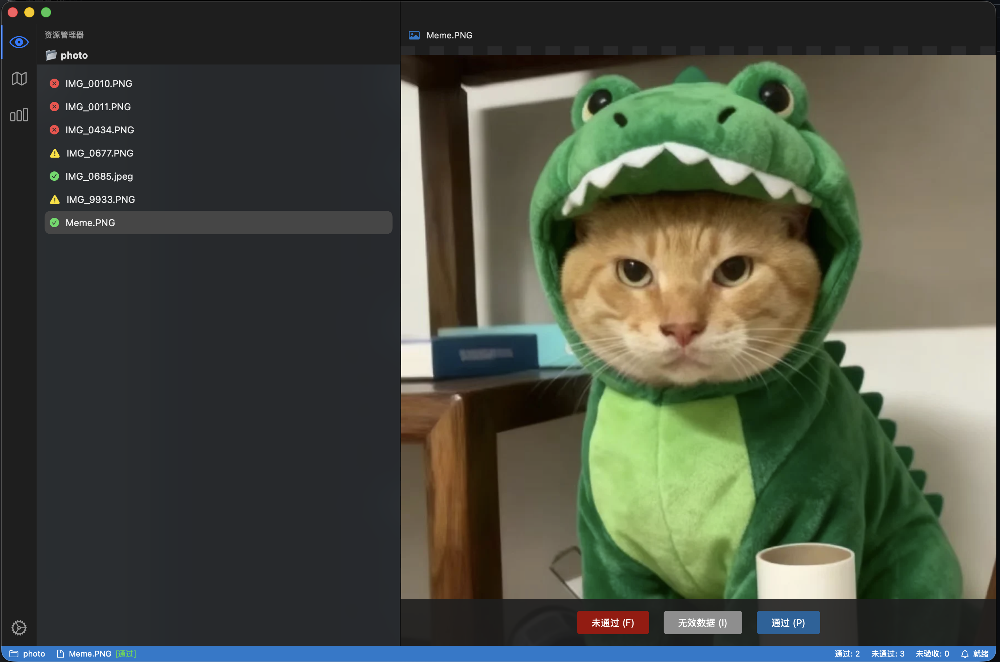

# 标签审核工具

<div align=center></div>


一个用于审核标注图像的 VS Code 风格应用程序。



## 功能
- **VS Code UI 布局**：熟悉的界面，包括活动栏、侧边栏和编辑区域。
- **图像审核**：浏览文件夹中的图像。
- **通过/未通过标记**：将图像标记为“通过”或“未通过”（快捷键：P / F）。
- **统计信息**：实时查看已审核图像的统计数据。
- **结果保存**：审核结果保存到图像文件夹中的 `review_results.json` 文件。

## 设置
1. 安装依赖：
    ```bash
    pip install -r requirements.txt
    ```
2. 运行应用程序：
    ```bash
    python main.py
    ```

## 使用方法
1. 点击侧边栏中的“打开文件夹”。
2. 选择包含图像的文件夹。
3. 点击列表中的图像以查看。
4. 按下 'P' 标记为通过，或按下 'F' 标记为未通过。
5. 切换到“统计信息”选项卡（活动栏）以查看进度。

## 扩展功能
要添加标注可视化（例如，边界框）：
1. 修改 `ui.py` -> `ImageViewer.load_image`。
2. 实现一个 `load_labels` 方法以读取特定的标注格式（JSON、XML、YOLO txt）。
3. 使用 `QGraphicsRectItem` 或类似方法在场景中绘制标注。
